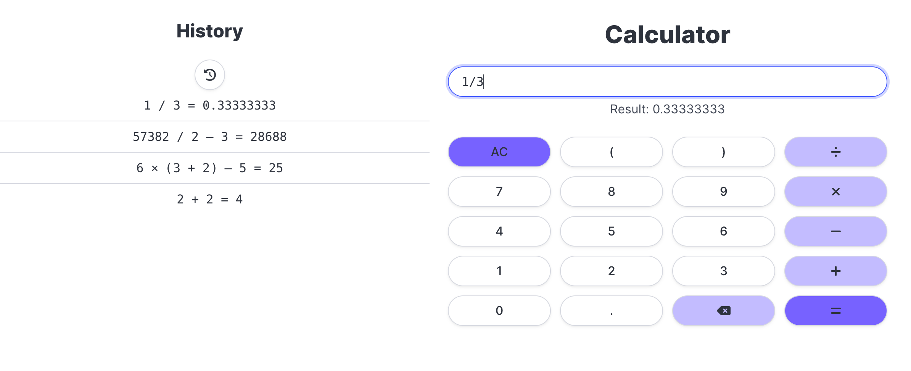
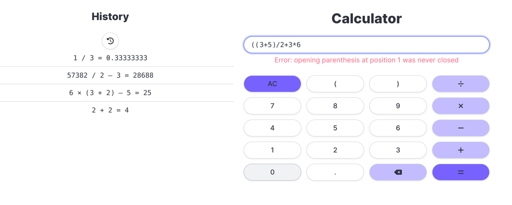
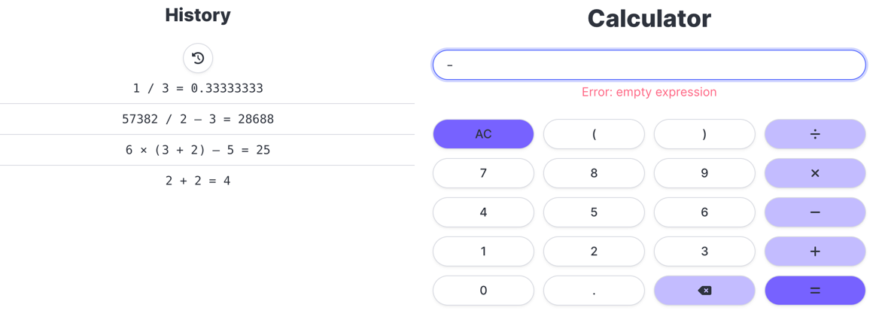
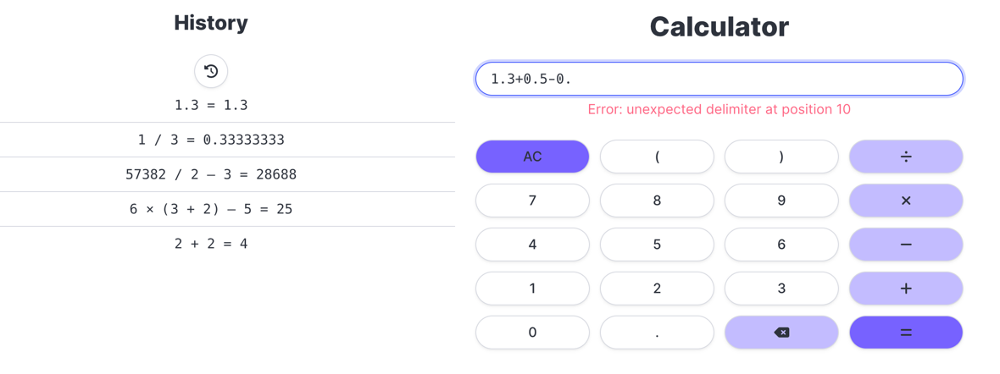

# Calculator service

This is a simple calculator service that can perform basic arithmetic operations.
Also, the history feature is implemented to store the history of the operations performed with a possibility to restore past operations.

## Executing

To run the backend server run the following command:

```bash
$ ./gradlew run
```

In order to run a frontend server, execute the following command:

```bash
python3 -m http.server --cgi --directory calculator-frontend 8000
```

And the frontend will be available at `http://localhost:8000`.

## Examples



### Errors examples:


---


---



---


---

